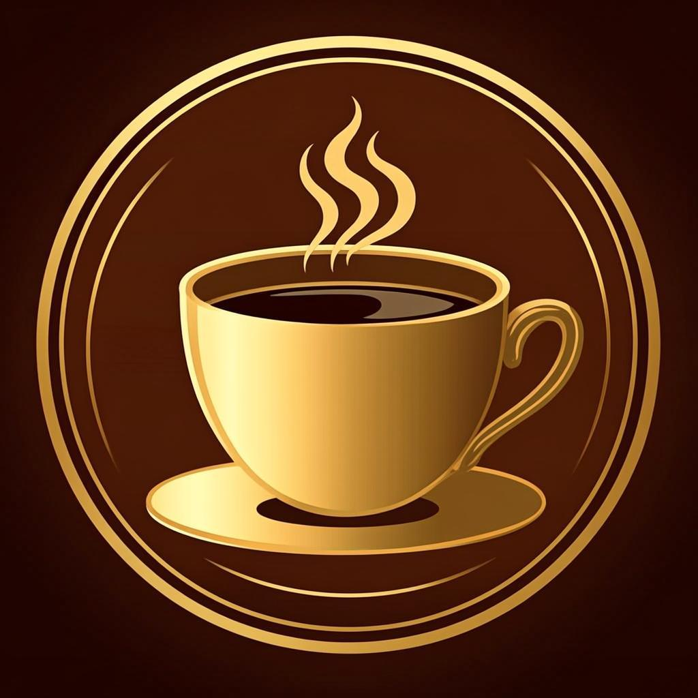

<div align="center">

<br/>



<br/>

# ✦ Auraum Café

### *Where Every Cup Tells a Story*

<br/>

[](https://nextjs.org/)
[](https://react.dev/)
[](https://www.typescriptlang.org/)
[](https://tailwindcss.com/)
[](https://www.framer.com/motion/)

<br/>

> **Auraum Café** is a full-featured, luxury artisan café web experience — blending premium UI design with a rich interactive frontend. Built with Next.js 16, React 19, and Framer Motion, it delivers buttery-smooth animations, a curated menu, cart & checkout flow, table reservations, and more.

<br/>

---

</div>

## 📸 Preview

| Hero Section | Menu & Filters | Cart & Checkout |
|:---:|:---:|:---:|
| Immersive full-screen hero with parallax | Category pills, search, sort & filter | Slide-over cart with order summary |

| Reviews | Our Story | Contact & Reservation |
|:---:|:---:|:---:|
| Animated testimonial carousel | Scroll-triggered story timeline | Interactive map + booking panel |

---

## ✨ Features

### 🛒 Commerce & Ordering
- **Interactive Menu** — Browse 10+ handcrafted items across 6 categories
- **Live Search Overlay** — Full-screen search with recent history, trending terms & recommendations
- **Category Filters** — Icon-driven filter pills with animated transitions
- **Smart Cart** — Add/remove items, quantity controls, real-time subtotal
- **Checkout Flow** — Address form, order summary, and confirmation animation

### 🗓️ Reservations & Profile
- **Table Booking** — Date picker, time slots, seating preference selector
- **Guest Profile** — Order history, loyalty points, preference management
- **5 Seating Options** — Indoor cozy, window seat, patio, coffee bar, private nook

### 🎨 Design & Experience
- **Luxury Aesthetic** — Warm cream/espresso/gold color palette with premium typography
- **Glassmorphism** — Frosted-glass cards, overlays, and navigation bar
- **Micro-animations** — Every interaction has a fluid Framer Motion animation
- **Loading Screen** — Branded cinematic intro with animated logo
- **Toast Notifications** — Non-intrusive feedback for cart, favorites & actions
- **Skeuomorphic Inputs** — Depth-styled form inputs with soft shadows

### 📱 Responsive & Accessible
- Fully responsive across mobile, tablet, and desktop
- Keyboard navigation support (ESC to close overlays, etc.)
- Semantic HTML with ARIA labels throughout
- `prefers-reduced-motion` friendly animations

---

## 🏗️ Tech Stack

| Category | Technology |
|---|---|
| **Framework** | [Next.js 16](https://nextjs.org/) (App Router, standalone output) |
| **UI Library** | [React 19](https://react.dev/) |
| **Language** | [TypeScript 5](https://www.typescriptlang.org/) |
| **Styling** | [Tailwind CSS v4](https://tailwindcss.com/) |
| **Animations** | [Framer Motion 12](https://www.framer.com/motion/) |
| **State Management** | [Zustand 5](https://zustand-demo.pmnd.rs/) |
| **Icons** | [Lucide React](https://lucide.dev/) + Custom PNG icons |
| **UI Primitives** | [Radix UI](https://www.radix-ui.com/) |
| **Forms** | [React Hook Form](https://react-hook-form.com/) + [Zod](https://zod.dev/) |
| **Data Fetching** | [TanStack Query](https://tanstack.com/query) |
| **Font** | Playfair Display (display) + Inter (body) |

---

## 📁 Project Structure

```
auraum-cafe/
├── public/
│   ├── icons/               # Category PNG icons (All, Hot Coffee, Cold Drinks…)
│   └── images/
│       └── cafe/            # Product images, logo, gallery assets
│
└── src/
    ├── app/
    │   ├── globals.css      # Design tokens, custom utilities & animations
    │   ├── layout.tsx       # Root layout with metadata & fonts
    │   └── page.tsx         # Main page composition
    │
    ├── components/
    │   └── cafe/
    │       ├── Navigation.tsx          # Sticky nav with cart/search triggers
    │       ├── HeroSection.tsx         # Full-screen hero with CTAs
    │       ├── DiscoverySection.tsx    # Personalized picks & trending
    │       ├── MenuSection.tsx         # Menu grid with filters & search
    │       ├── SearchOverlay.tsx       # Full-screen search experience
    │       ├── ReviewsSection.tsx      # Testimonial carousel
    │       ├── StorySection.tsx        # Brand story timeline
    │       ├── SocialGallery.tsx       # Instagram-style image grid
    │       ├── ContactSection.tsx      # Contact form + location
    │       ├── CartAndCheckout.tsx     # Slide-over cart + checkout
    │       ├── ReservationAndProfile.tsx  # Booking + user profile panel
    │       ├── Footer.tsx              # Site footer with links
    │       ├── LoadingScreen.tsx       # Animated intro screen
    │       └── ToastContainer.tsx      # Global notification system
    │
    ├── lib/
    │   └── cafe-data.ts     # Menu items, categories, reviews, time slots
    │
    └── store/
        └── cafe-store.ts    # Global Zustand state (cart, favorites, UI state)
```

---

## 🚀 Getting Started

### Prerequisites

- **Node.js** v18+ or **Bun** v1.3+
- A package manager: `npm`, `bun`, or `yarn`

### Installation

```bash
# 1. Clone the repository
git clone https://github.com/your-username/auraum-cafe.git
cd auraum-cafe

# 2. Install dependencies
npm install
# or
bun install

# 3. Start the development server
npm run dev
# or
bun dev
```

Open [http://localhost:3000](http://localhost:3000) in your browser. 🎉

### Available Scripts

| Command | Description |
|---|---|
| `npm run dev` | Start development server on port 3000 |
| `npm run build` | Build production bundle |
| `npm run start` | Start production server |
| `npm run lint` | Run ESLint checks |

---

## 🎨 Design System

The entire design system lives in [`src/app/globals.css`](src/app/globals.css).

### Color Palette

| Token | Value | Usage |
|---|---|---|
| `--cream` | `#fdf6ec` | Page background |
| `--espresso` | `#2c1810` | Primary text |
| `--gold` | `#c49a2a` | Accent, CTAs, highlights |
| `--coffee-50` | `#faf5f0` | Subtle backgrounds |
| `--coffee-100` | `#f0e6d8` | Card borders, dividers |

### Typography

- **Display** — `Playfair Display` (headings, hero text)
- **Body** — `Inter` (paragraphs, labels, buttons)

### Elevation

```css
--shadow-soft   /* Resting cards */
--shadow-float  /* Hovered/elevated cards */
--shadow-inset  /* Pressed states, inputs */
```

---

## 📦 Key Dependencies

```json
{
  "next": "^16.1.1",
  "react": "^19.0.0",
  "framer-motion": "^12.23.2",
  "zustand": "^5.0.6",
  "tailwindcss": "^4",
  "lucide-react": "^0.525.0",
  "@radix-ui/react-*": "latest",
  "react-hook-form": "^7.60.0",
  "zod": "^4.0.2",
  "@tanstack/react-query": "^5.82.0"
}
```

---

## 🗺️ Roadmap

- [ ] **Backend integration** — Connect to a real menu API / CMS
- [ ] **Authentication** — NextAuth.js login for loyalty profiles
- [ ] **Payment gateway** — Razorpay / Stripe checkout integration
- [ ] **Real-time orders** — WebSocket order status tracking
- [ ] **PWA support** — Offline-capable progressive web app
- [ ] **Admin dashboard** — Menu management and order monitoring
- [ ] **Dark mode** — Full dark theme variant

---

## 🤝 Contributing

Contributions are welcome! Please follow these steps:

1. Fork the repository
2. Create your feature branch: `git checkout -b feature/amazing-feature`
3. Commit your changes: `git commit -m 'Add amazing feature'`
4. Push to the branch: `git push origin feature/amazing-feature`
5. Open a Pull Request

---

## 📄 License

This project is licensed under the **MIT License** — feel free to use it for personal or commercial projects.

---

<div align="center">

<br/>

Crafted with ☕ and passion

**[Auraum Café](http://localhost:3000)** — *Luxury Artisan Coffee Experience*

<br/>

</div>
